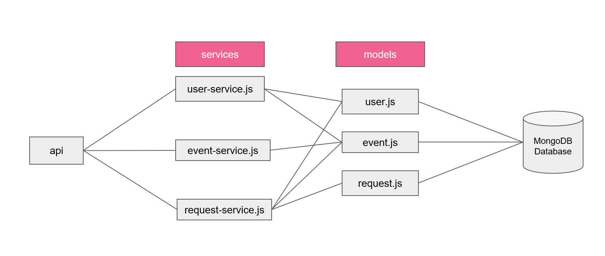
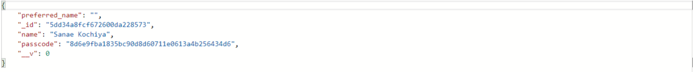
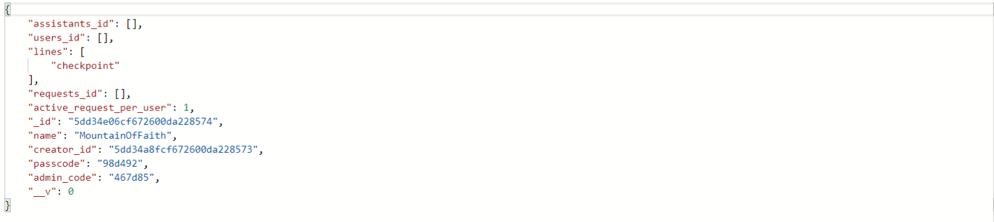

# Intro

APIs are classified by Services

# Content 
- Authentication (non-standard)
- User
- Event
- Request

## Auth
- GET (validation)
- POST (registration)

## User
- POST (update user)
- DELETE (remove user)

## Event
- GET 
"/:id" (get ID); 
"/view/:id" (view event)
- PUT (create event)
- POST
"/:id" (update event)
"/join/:id" (join a user)
- DELETE
"/:id" (delete an event)
## Request
- GET
"/:id" (get request)
- PUT (create request)
- POST 
"/:id" (update request)

# Examples
The post is manually generated with Postman to test the backend  
## Add user "Sanae Kochiya"
- Type: POST
- Body
"name": "Sanae Kochiya"
- Results

## Add user "Sanae Kochiya" into event "MountainOfFaith"
- Type: POST
- Headers
"user_id": \<generated in auth>
"passcode": \<generated in auth>
- Body
"name": "MountainOfFaith"
"lines": "checkpoint"
- Results
